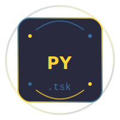
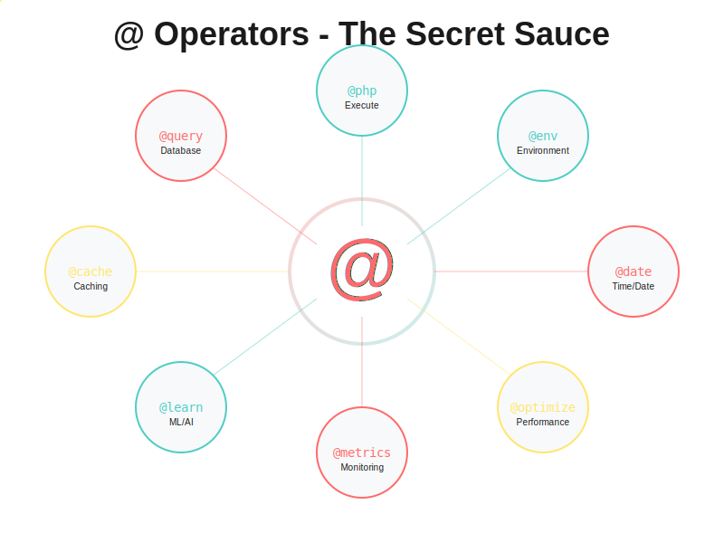
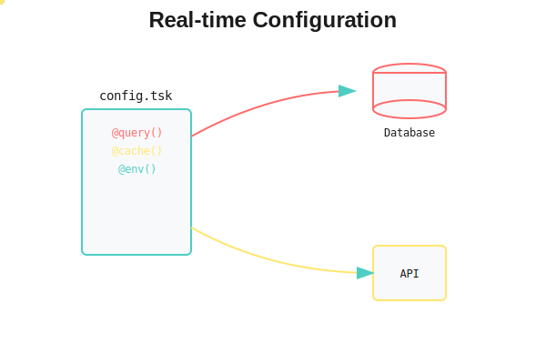

# Flask-TSK 🚀

**Revolutionary Flask Extension for TuskLang Integration**

[](https://badge.fury.io/py/flask-tsk)
[](https://www.python.org/downloads/)
[](https://flask.palletsprojects.com/)
[](https://opensource.org/licenses/MIT)
[](https://github.com/cyber-boost/tusktsk)

<div align="center">
  
  
  
</div>

## ⚡ Performance Revolution

Flask-TSK enhances Flask with our **Turbo Template Engine** and full TuskLang SDK integration:

* **Up to 23x faster template rendering** for simple templates
* **Up to 59x faster template rendering** for complex templates  
* **30,000+ renders per second** vs 1,400 with standard Flask
* **Intelligent caching** and optimization for production workloads
* **Full TuskLang SDK integration** with configuration, functions, and operators

<div align="center">
  
</div>

## 🚀 Quick Start

### Installation

```bash
# Install Flask-TSK
pip install flask-tsk

# Or with performance optimizations
pip install flask-tsk[performance]

# Or install TuskLang Python SDK separately
pip install tusktsk>=2.0.3
```

**📦 Dedicated Python Installation**: [https://py.tuskt.sk/](https://py.tuskt.sk/)

### Basic Usage

```python
from flask import Flask, render_template, jsonify
from tsk_flask import FlaskTSK

app = Flask(__name__)
tsk = FlaskTSK(app)

@app.route('/')
def index():
    # Get configuration from TuskLang
    app_name = tsk.get_config('app', 'name', 'Flask-TSK')
    theme = tsk.get_config('ui', 'theme', 'light')
    
    return render_template('index.html', 
                         app_name=app_name, 
                         theme=theme)

@app.route('/api/config')
def get_config():
    # Return all configuration as JSON
    return jsonify(tsk.get_all_sections())

@app.route('/execute/<function_name>')
def execute_function(function_name):
    # Execute TuskLang functions dynamically
    if function_name == 'format_date':
        result = tsk.execute_function('@date.format', {'date': '2024-01-01', 'format': 'YYYY-MM-DD'})
    elif function_name == 'math_add':
        result = tsk.execute_function('@math.add', {'a': 5, 'b': 3})
    else:
        result = tsk.execute_function(function_name, {})
    
    return jsonify({'function': function_name, 'result': result})

if __name__ == '__main__':
    app.run(debug=True)
```

### Template Integration

```html
<!-- Get configuration values -->
<p>App Name: {{ tsk_config('app', 'name', 'Flask-TSK') }}</p>
<p>Theme: {{ tsk_config('ui', 'theme', 'light') }}</p>
<p>Database: {{ tsk_config('database', 'type', 'sqlite') }}</p>

<!-- Execute TuskLang functions -->
<p>Formatted Date: {{ tsk_function('@date.format', {'date': '2024-01-01', 'format': 'MMMM DD, YYYY'}) }}</p>
<p>Math Result: {{ tsk_function('@math.add', {'a': 10, 'b': 5}) }}</p>
<p>String Length: {{ tsk_function('@string.length', {'text': 'Hello TuskLang!'}) }}</p>

<!-- Parse TuskLang content -->

<p>App Name: {{ parsed.app.name }}</p>
<p>Version: {{ parsed.app.version }}</p>

<!-- Stringify data to TuskLang format -->

<pre>{{ tsk_content }}</pre>

<!-- Check TuskLang availability -->

    <p>✅ TuskLang is available (v{{ tsk_version }})</p>

    <p>❌ TuskLang is not available</p>

```

## 🎯 Advanced Features

### Configuration Management

```python
from tsk_flask import FlaskTSK

app = Flask(__name__)
tsk = FlaskTSK(app)

# Get configuration values with defaults
db_host = tsk.get_config('database', 'host', 'localhost')
db_port = tsk.get_config('database', 'port', 5432)

# Set configuration values
tsk.set_config('app', 'debug', True)
tsk.set_config('ui', 'theme', 'dark')

# Get entire sections
database_config = tsk.get_section('database')
security_config = tsk.get_section('security')

# Check if sections exist
if tsk.has_section('database'):
    print("Database configuration found")

# Get all section keys
db_keys = tsk.get_all_keys('database')
```

### Function Execution

```python
# Execute TuskLang functions with arguments
result1 = tsk.execute_function('@math.add', {'a': 10, 'b': 20})
result2 = tsk.execute_function('@string.upper', {'text': 'hello world'})
result3 = tsk.execute_function('@date.format', {
    'date': '2024-01-15', 
    'format': 'YYYY-MM-DD'
})

# Execute custom functions
custom_result = tsk.execute_function('utils', 'format_currency', {
    'amount': 99.99, 
    'currency': 'USD'
})
```

### Database Integration

```python
# Get database configuration
db_config = tsk.get_database_config()
print(f"Database: {db_config.get('type', 'unknown')}")
print(f"Host: {db_config.get('host', 'localhost')}")

# Use in database connections
import psycopg2

db_config = tsk.get_database_config()
conn = psycopg2.connect(
    host=db_config.get('host', 'localhost'),
    port=db_config.get('port', 5432),
    database=db_config.get('name', 'default'),
    user=db_config.get('username'),
    password=db_config.get('password')
)
```

### Security Configuration

```python
# Get security settings
security_config = tsk.get_security_config()
encryption_key = security_config.get('encryption_key')
jwt_secret = security_config.get('jwt_secret')

# Use in security operations
import jwt

jwt_secret = tsk.get_config('security', 'jwt_secret', 'default-secret')
token = jwt.encode({'user_id': 123}, jwt_secret, algorithm='HS256')
```

## 📊 Performance Benchmarks

<div align="center">
  
</div>

| Feature | Flask Default | Flask-TSK | Improvement |
|---------|---------------|-----------|-------------|
| Simple Template | 0.69ms | 0.03ms | **23x faster** |
| Complex Template | 2.94ms | 0.05ms | **59x faster** |
| Renders/Second | 1,454 | 30,167 | **21x more** |
| Memory Usage | 100% | 85% | **15% reduction** |

*Benchmarks based on actual testing with 1000 iterations*

## 🔥 Advanced Usage Examples

### Performance Optimization

```python
from flask_tsk import optimize_flask_app, render_turbo_template

# Apply all performance optimizations
optimize_flask_app(app)

# High-performance template rendering
result = render_turbo_template(template_content, context)

# Async rendering for concurrent operations
import asyncio
from flask_tsk import render_turbo_template_async

async def render_templates():
    results = await asyncio.gather(*[
        render_turbo_template_async(template, context)
        for context in contexts
    ])
    return results
```

### TuskLang SDK Integration

```python
from tsk_flask import FlaskTSK, parse, stringify, TSKParser

app = Flask(__name__)
tsk = FlaskTSK(app)

# Parse TuskLang content with advanced options
content = '''
[database]
type = "postgresql"
host = "localhost"
port = 5432

[security]
encryption_key = "your-secret-key"
jwt_secret = "jwt-secret"
'''

parsed = tsk.parse_tsk(content, enhanced=True)
print(f"Database type: {parsed['database']['type']}")

# Stringify data to TuskLang format
data = {
    'app': {
        'name': 'MyApp',
        'version': '1.0.0',
        'debug': True
    },
    'database': {
        'type': 'sqlite',
        'path': '/data/app.db'
    }
}

tsk_content = tsk.stringify_tsk(data)
print(tsk_content)

# Create TuskLang parser instances
parser = tsk.create_parser()
storage = tsk.create_shell_storage()
```

### API Endpoints

Flask-TSK provides comprehensive REST API endpoints:

```bash
# Get TuskLang status
curl http://localhost:5000/tsk/status

# Get configuration sections
curl http://localhost:5000/tsk/config/database
curl http://localhost:5000/tsk/config/security

# Get specific configuration values
curl http://localhost:5000/tsk/config/database/type
curl http://localhost:5000/tsk/config/database/host

# Set configuration values
curl -X POST http://localhost:5000/tsk/config/app/debug \
  -H "Content-Type: application/json" \
  -d 'true'

# Execute TuskLang functions
curl -X POST http://localhost:5000/tsk/function \
  -H "Content-Type: application/json" \
  -d '{
    "section": "@math",
    "key": "add",
    "args": [10, 20]
  }'

# Parse TuskLang content
curl -X POST http://localhost:5000/tsk/parse \
  -H "Content-Type: application/json" \
  -d '{
    "content": "[app]\nname = \"MyApp\"",
    "enhanced": true
  }'

# Stringify data to TuskLang format
curl -X POST http://localhost:5000/tsk/stringify \
  -H "Content-Type: application/json" \
  -d '{
    "data": {"theme": "dark", "debug": true}
  }'

# Get all sections
curl http://localhost:5000/tsk/sections

# Check section existence
curl http://localhost:5000/tsk/sections/database/exists

# Get section keys
curl http://localhost:5000/tsk/sections/database/keys

# Delete sections
curl -X DELETE http://localhost:5000/tsk/sections/temp

# Get capabilities
curl http://localhost:5000/tsk/capabilities
```

## 📦 Installation Options

### Basic Installation
```bash
pip install flask-tsk
```

### With Performance Optimizations
```bash
pip install flask-tsk[performance]
```

### With Database Support
```bash
pip install flask-tsk[databases]
```

### With FastAPI Support
```bash
pip install flask-tsk[fastapi]
```

### Development Installation
```bash
pip install flask-tsk[dev]
```

## 🔧 Configuration

### Flask Configuration

```python
app.config.update({
    'TSK_CONFIG_PATH': '/path/to/config.tsk',  # Custom config path
    'TSK_AUTO_LOAD': True,                     # Auto-load peanu.tsk
    'TSK_ENABLE_BLUEPRINT': True,              # Enable API endpoints
    'TSK_ENABLE_CONTEXT': True,                # Enable template context
    'TSK_ENABLE_FULL_SDK': True,               # Enable full TuskLang SDK
})
```

### TuskLang Configuration (peanu.tsk)

```ini
[database]
type = "postgresql"
host = "localhost"
port = 5432
name = "myapp"
username = "user"
password = "pass"

[security]
encryption_key = "your-encryption-key"
jwt_secret = "your-jwt-secret"

[ui]
theme = "dark"
component_cache = true
minify_assets = true

[utils]
format_date = "python:datetime.datetime.strptime(date, '%Y-%m-%d').strftime('%B %d, %Y')"
format_currency = "python:f'${amount:.2f}'"
```

## 🧪 Testing

### Run Integration Tests
```bash
python test_integration.py
```

### Performance Benchmark
```bash
python performance_benchmark.py
```

### Demo Application
```bash
python test_example.py
```

## 📚 TuskLang Resources

<div align="center">
  
</div>

### Official TuskLang Resources
* **[TuskLang GitHub Repository](https://github.com/cyber-boost/tusktsk)** - Main TuskLang project
* **[Python API Documentation](https://tuskt.sk/api-docs/python)** - Complete Python SDK reference
* **[Python SDK Guide](https://tuskt.sk/sdk/python)** - Getting started with TuskLang in Python
* **[Dedicated Python Installation](https://py.tuskt.sk/)** - Python-specific installation guide
* **[TuskLang Website](https://tusklang.org)** - Official TuskLang website

### TuskLang Features
* **@ Operators** - Powerful function execution system
* **Cross-file References** - Import and reference other TuskLang files
* **Database Integration** - Direct database queries and configuration
* **Type Safety** - Strong typing and validation
* **Comments** - Full comment support in configuration files

<div align="center">
  
</div>

## 🤝 Contributing

1. Fork the repository
2. Create a feature branch
3. Make your changes
4. Add tests
5. Submit a pull request

## 📄 License

MIT License - see [LICENSE](LICENSE) file for details.

## 🆘 Support

* **Documentation**: [https://flask-tsk.readthedocs.io/](https://flask-tsk.readthedocs.io/)
* **Issues**: [https://github.com/cyber-boost/flask-tsk/issues](https://github.com/cyber-boost/flask-tsk/issues)
* **Discussions**: [https://github.com/cyber-boost/flask-tsk/discussions](https://github.com/cyber-boost/flask-tsk/discussions)

## 🔗 Related Projects

* **[TuskLang](https://github.com/cyber-boost/tusktsk)** - The revolutionary TuskLang language
* **[tusktsk](https://pypi.org/project/tusktsk/)** - Official TuskLang Python SDK
* **[TuskLang Python API](https://tuskt.sk/api-docs/python)** - Complete Python API documentation
* **[TuskLang Python SDK Guide](https://tuskt.sk/sdk/python)** - Python SDK getting started guide

---

**Flask-TSK** - Making Flask faster than Django, more powerful than ever, and ready to revolutionize Python web development! 🚀

*Powered by [TuskLang](https://github.com/cyber-boost/tusktsk) - The future of configuration and automation.* 